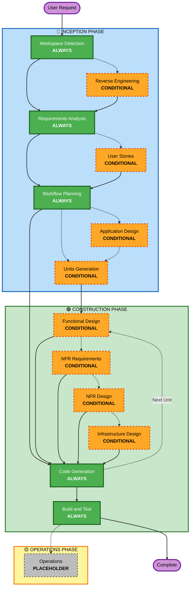

# AI-DLC 적응형 작업 흐름 개요

**목적**: AI 모델 및 개발자가 전체 워크플로 구조를 이해하기 위한 기술 참조입니다.

**참고**: Welcome-message.md(사용자 환영 메시지) 및 README.md(문서)에도 유사한 콘텐츠가 있습니다. 이 중복은 의도적인 것입니다. 각 파일은 서로 다른 용도로 사용됩니다.
- **이 파일**: AI 모델 컨텍스트 로딩을 위한 인어 다이어그램에 대한 자세한 기술 참조
- **welcome-message.md**: ASCII 다이어그램이 포함된 사용자용 환영 메시지
- **README.md**: 사람이 읽을 수 있는 저장소 문서

## 3단계 라이프사이클:
• **시작 단계**: 계획 및 아키텍처(작업 공간 감지 + 조건부 단계 + 워크플로 계획)
• **구성 단계**: 설계, 구현, 구축 및 테스트(단위별 설계 + 코드 생성 + 구축 및 테스트)
• **운영 단계**: 향후 배포 및 모니터링 워크플로를 위한 자리 표시자

## 적응형 작업 흐름:
• **작업 공간 감지**(항상) → **리버스 엔지니어링**(브라운필드에만 해당) → **요구 사항 분석**(항상, 적응형 깊이) → **조건부 단계**(필요에 따라) → **워크플로 계획**(항상) → **코드 생성**(항상, 단위당) → **빌드 및 테스트**(항상)

## 작동 방식:
• **AI가 요청, 작업 공간, 복잡성을 분석**하여 필요한 단계를 결정합니다.
• **이러한 단계는 항상 실행됩니다**: 작업 공간 감지, 요구 사항 분석(적응형 깊이), 워크플로 계획, 코드 생성(단위당), 빌드 및 테스트
• **다른 모든 단계는 조건부입니다**: 리버스 엔지니어링, 사용자 스토리, 애플리케이션 설계, 유닛 생성, 유닛별 설계 단계(기능 설계, NFR 요구 사항, NFR 설계, 인프라 설계)
• **고정된 순서 없음**: 특정 작업에 적합한 순서대로 단계가 실행됩니다.

## 팀의 역할:
• [답변]을 사용하여 전용 질문 파일의 **질문에 답변**: 문자 선택이 포함된 태그(A, B, C, D, E)
• **옵션 E 사용 가능**: '기타'를 선택하고 제공된 옵션이 일치하지 않는 경우 맞춤 응답을 설명하세요.
• **팀으로 작업**하여 진행하기 전에 각 단계를 검토하고 승인합니다.
• 필요한 경우 아키텍처 접근 방식을 **총체적으로 결정**
• **중요**: 이는 팀 노력입니다. 각 단계에 관련 이해관계자가 참여합니다.

## AI-DLC 3단계 작업 흐름:

**단계 설명:**

**🔵 시작 단계** - 계획 및 아키텍처
- 작업공간 감지: 작업공간 상태 및 프로젝트 유형 분석(항상)
- 리버스 엔지니어링: 기존 코드베이스 분석(조건부 - 브라운필드에만 해당)
- 요구사항 분석: 요구사항 수집 및 검증(항상 - 적응형 깊이)
- 사용자 스토리: 사용자 스토리 및 페르소나 생성(조건부)
- 워크플로 계획: 실행 계획 생성(항상)
- 애플리케이션 설계: 높은 수준의 구성 요소 식별 및 서비스 계층 설계(조건부)
- 단위 생성: 작업 단위로 분해(조건부)

**🟢 건설 단계** - 설계, 구현, 구축 및 테스트
- 기능 설계: 단위별 세부 비즈니스 로직 설계(조건부, 단위별)
- NFR 요구사항: NFR 결정 및 기술 스택 선택(조건부, 단위당)
- NFR 설계: NFR 패턴 및 논리적 구성요소 통합(조건부, 단위별)
- 인프라 설계: 실제 인프라 서비스에 대한 매핑(조건부, 단위별)
- 코드 생성: 1부 - 계획, 2부 - 생성으로 코드 생성(항상, 단위당)
- 빌드 및 테스트: 모든 유닛을 빌드하고 포괄적인 테스트를 실행합니다(항상).

**🟡 작업 단계** - 자리표시자
- 작업: 향후 배포 및 모니터링 워크플로를 위한 자리 표시자(PLACEHOLDER)

**주요 원칙:**
- 단계는 가치를 추가할 때만 실행됩니다.
- 각 단계는 독립적으로 평가됩니다.
- INCEPTION은 '무엇'과 '왜'에 중점을 둡니다.
- CONSTRUCTION은 "방법"과 "구축 및 테스트"에 중점을 둡니다.
- OPERATIONS는 향후 확장을 위한 자리 표시자입니다.
- 간단한 변경으로 인해 조건부 INCEPTION 단계를 건너뛸 수 있습니다.
- 복잡한 변경은 완전한 INCEPTION 및 CONSTRUCTION 처리를 받습니다.